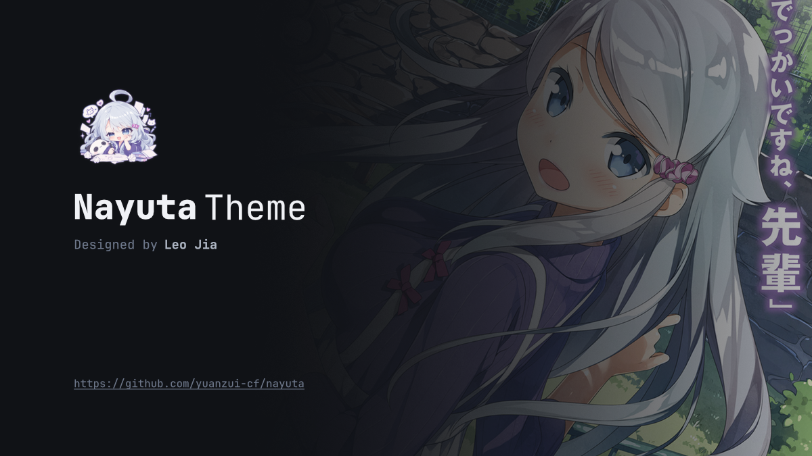
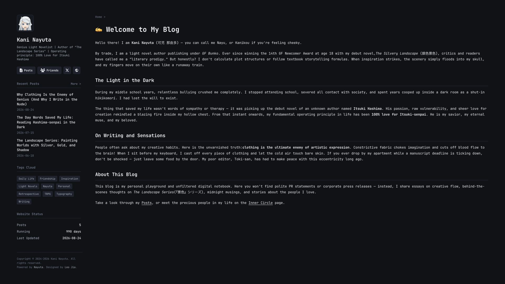
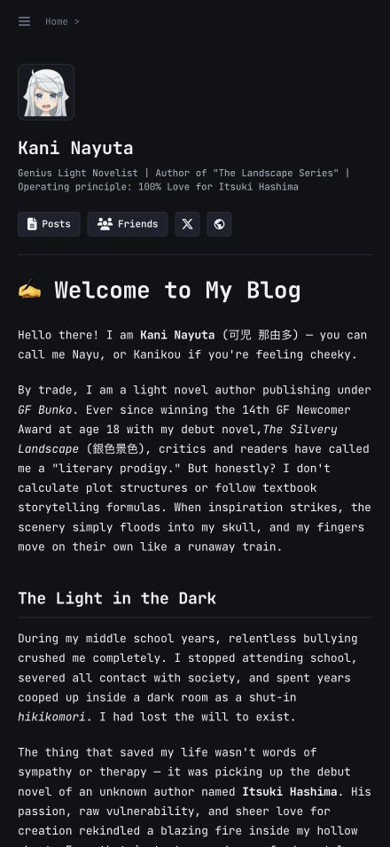
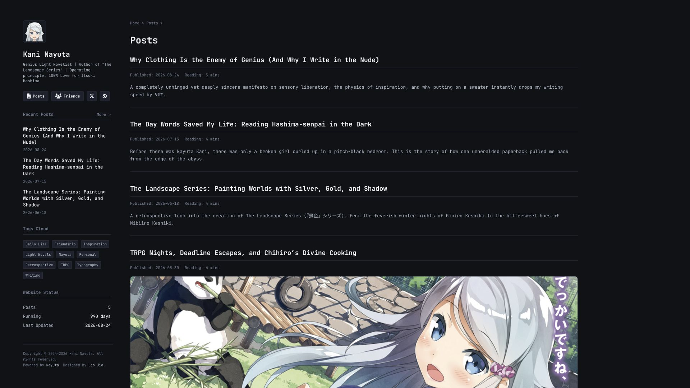
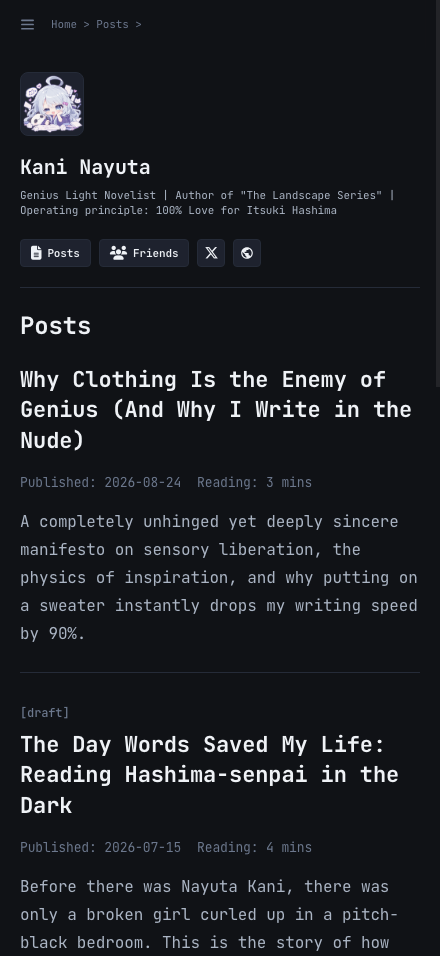
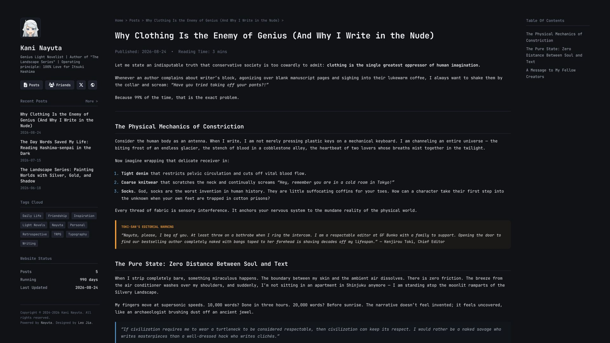
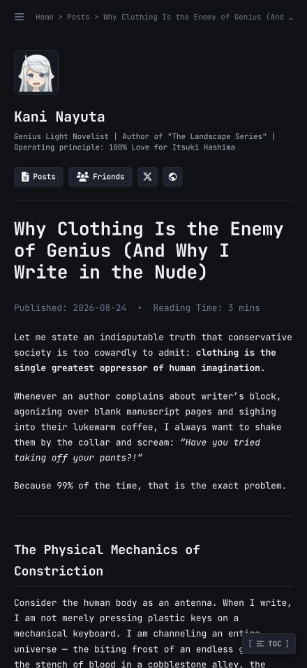
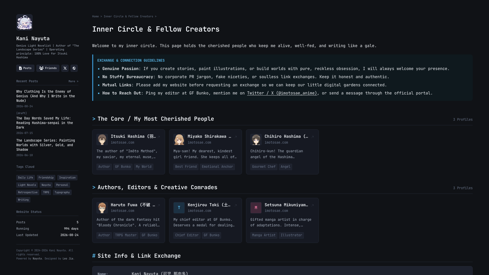
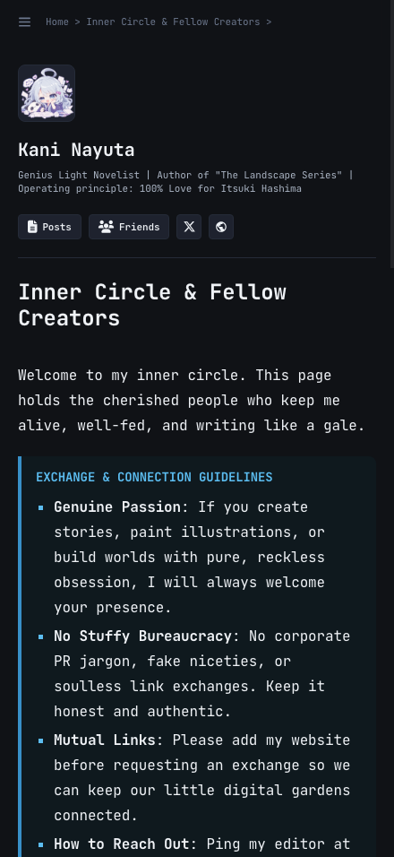

<div align="center">



<br />
<br />

# Nayuta

**A responsive, reading-first Astro theme for personal homepages and blogs, with reading-first layouts, reusable UI components, composed profile/blog widgets, semantic tokens, and accessible responsive surfaces.**

[](https://astro.build)
[](https://www.typescriptlang.org)
[](https://bun.sh)

[Visual Showcase](#-visual-showcase) • [Key Features](#-key-features) • [Architecture](#-architecture) • [Getting Started](#-getting-started) • [Configuration](#-configuration)

</div>

---

## 📖 Overview

**Nayuta** is an Astro theme designed with a strict **reading-first** philosophy. Engineered for developers and writers, Nayuta pairs high-performance static site generation with a clean, compact monospace visual aesthetic.

It implements an adaptive multi-column layout structure that keeps prose readable on wide desktop viewports while collapsing side widgets into accessible, slide-out drawers on smaller screens.

> **Nayuta** takes its name from **Kani Nayuta** (_可児 那由多_), the eccentric, uninhibited genius novelist from Yomi Hirasaka's _A Sister's All You Need_ (_妹さえいればいい。_).

> [!IMPORTANT]
> The template is still under rapid development. Breaking changes may occur.

---

## 📸 Visual Showcase

<div align="center">

### Home Page

_Three-column desktop layout featuring the identity card, reading stream, and responsive mobile adaptation._

|                                 Desktop Experience (1920×1080)                                  |                                 Responsive Mobile (440×956)                                 |
| :---------------------------------------------------------------------------------------------: | :-----------------------------------------------------------------------------------------: |
|  |  |

<br />

### Posts Stream & Archive

_Paginated timeline stream with tag filtering, reading time indicators, and collapsed drawer navigation._

|                                  Desktop Experience (1920×1080)                                   |                                  Responsive Mobile (440×956)                                  |
| :-----------------------------------------------------------------------------------------------: | :-------------------------------------------------------------------------------------------: |
|  |  |

<br />

### Article & Long-Form Reading

_Reading view with hierarchical Table of Contents, code blocks, callouts, and clean mobile reading flow._

|                                    Desktop Experience (1920×1080)                                     |                                    Responsive Mobile (440×956)                                    |
| :---------------------------------------------------------------------------------------------------: | :-----------------------------------------------------------------------------------------------: |
|  |  |

<br />

### Friends & Connection Wall

_Interactive friend links wall with connection cards, exchange guidelines, and responsive single-column layout._

|                                    Desktop Experience (1920×1080)                                     |                                    Responsive Mobile (440×956)                                    |
| :---------------------------------------------------------------------------------------------------: | :-----------------------------------------------------------------------------------------------: |
|  |  |

</div>

---

## ✨ Key Features

- **📖 Reading-First Typography**: Monospace-centered typography stack (JetBrains Mono & Fira Code) with comfortable prose rhythm, code styling, and callouts.
- **📐 Adaptive Three-Column Layout (`[left] [main] [right?]`)**:
  - **Left Region**: Identity card (`ProfileCard`), recent post list (`RecentPosts`), tag cloud (`TagCloud`, on post detail pages), site status (`WebsiteStatus`), and navigation links.
  - **Main Region**: Primary reading content, article stream, or custom page markdown.
  - **Right Region**: Contextual widgets (e.g., Table of Contents on articles, or custom widgets on pages).
- **📱 Responsive Drawer Navigation**: On screens below 1120px/768px, sidebars collapse into a sticky top navigation bar with toggleable slide-out drawers powered by lightweight vanilla JS.
- **⚡ Astro 7 Content Collections**: Type-safe frontmatter validation with Zod schemas and Astro `glob` loaders for both `posts` and `pages`.
- **🏷️ Post Tags**: Multiple tags per article, linked at the end of each post, with static `/tag/<name>` archives and a content-driven tag cloud.
- **🎨 Preset Theme Palettes**: Includes 5 pre-bundled CSS theme stylesheets (`nayuta`, `nayuta-aqua`, `midnight-blue`, `oled-dark`, `sakura-pink`) in `src/assets/styles/themes/`, selected statically via `config.ts` and injected at build time.
- **👥 Built-in Templates**:
  - `PageTemplate`: Default multi-column page template with slots for sidebar widgets and styled prose.
  - `FriendTemplate`: Categorized friend links wall with custom connection cards and link exchange information card.
- **🧩 Configurable Sidebar Widgets**: Pages can declaratively specify which right sidebar widgets to mount (`tag-cloud`, `categories`, `recent-posts`, `website-status`, `search`) via the `rightWidgets` frontmatter array.

---

## 🏛 Architecture

Nayuta organizes its code into distinct layers of responsibility:

```text
nayuta/
├── src/
│   ├── layout/             # Page structure and directly embedded UI
│   │   ├── components/     # Internal UI pieces (Prose, Pagination, ProfileCard, etc.)
│   │   └── post-list/      # Shared archive and dynamic result presentation
│   ├── widgets/            # User-facing components
│   │   ├── sidebar/        # RecentPosts, TableOfContents, WebsiteStatus, etc.
│   │   └── article/        # MDX components such as Callout and TableContainer
│   ├── templates/          # Pre-assembled page layouts (PageTemplate.astro, FriendTemplate.astro)
│   ├── pages/              # Astro routes & dynamic slug handlers ([...slug].astro, posts/)
│   ├── content/            # Markdown & MDX content collections
│   │   ├── posts/          # Blog articles and notes
│   │   └── pages/          # Standalone pages (e.g. friend.mdx)
│   ├── assets/styles/      # Global CSS variables and theme presets (themes/*.css)
│   ├── utils/              # Logic shared by build-time and browser consumers
│   ├── content.config.ts   # Content collection schemas (Zod) and glob loaders
│   └── config.ts           # Site configuration (author, theme, navigation links)
├── docs/                   # Agent specifications and preview assets
├── public/                 # Static public files (images, avatars, banners)
└── tests/                  # components/, content/, layout/, fixtures/
```

---

## 🚀 Getting Started

### Prerequisites

Ensure you have [Bun](https://bun.sh) (recommended) or [Node.js](https://nodejs.org) (v18+) installed:

```bash
bun --version
```

### Installation

```bash
# Clone the repository
git clone https://github.com/yuanzui-cf/nayuta.git
cd nayuta

# Install dependencies
bun install
```

### Development

Start the local development server:

```bash
bun run dev
```

Visit `http://localhost:4321` in your browser.

### Production Build

```bash
# Type check Astro templates and TypeScript files
bun run check

# Test reading-time calculation and post tags, including Astro integration
bun run test

# Build static output
bun run build

# Preview static build locally
bun run preview
```

Static output will be generated in `dist/`.

The project uses TypeScript 6 because the official `@astrojs/check` currently
supports TypeScript 5/6, not TypeScript 7. `bun run check` runs both `astro check`
and `tsc` so template errors, including invalid HTML attribute types, are caught
alongside ordinary TypeScript errors. Building or formatting alone does not
validate Astro template types.

---

## ⚙ Configuration

### 1. Site Configuration (`src/config.ts`)

Site title, author bio, static theme preset, and navigation links are configured in [`src/config.ts`](./src/config.ts):

```typescript
import type { Config } from './types/config';

const config: Config = {
  title: '✍️ Kani Nayuta',
  author: 'Kani Nayuta',
  avatar: '/assets/images/avatar.jpg',
  description: 'Genius Light Novelist | Author of "The Landscape Series"',
  site_url: 'https://nayuta.kani.dev',
  // Available theme presets: 'nayuta', 'nayuta-aqua', 'midnight-blue', 'oled-dark', 'sakura-pink'
  theme: 'nayuta',
  since: '2024-01-01',
  links: [
    {
      text: 'Posts',
      url: '/posts',
      icon: { type: 'icon', name: 'fa-solid fa-file-lines' },
    },
    {
      text: 'Friends',
      url: '/friend',
      icon: { type: 'icon', name: 'fa-solid fa-users' },
    },
  ],
};

export default config;
```

### 2. Publishing Posts (`src/content/posts/`)

Create `.md` or `.mdx` files in `src/content/posts/`:

```markdown
---
title: 'The Architecture of Reading-First Design'
publishDate: '2026-09-09'
description: 'A deep dive into balancing information density and typography.'
cover: '/assets/images/banner.png'
tags: ['Astro', '前端开发', 'CSS Grid']
---

Article body in Markdown or MDX...
```

MDX components intended for article authors live in `src/widgets/article/`.
For example, a post under `src/content/posts/` can import `Callout` from
`../../widgets/article/Callout.astro`.

`tags` is an optional array of strings with no fixed tag count. Omit it or use
`tags: []` for an untagged post. Names are trimmed, must not be empty, and are
deduplicated in their authored order. Matching is case-sensitive: `Astro` and
`astro` are separate tags.

Tags appear after the article body and link to `/tag/<name>`. Each archive lists
all matching articles by publish date, newest first, with the same cover,
description, and reading-time display as `/posts`. Chinese names and spaces are
supported; links are URL-encoded (for example, `CSS Grid` links to
`/tag/CSS%20Grid`). Archives are generated at build time for tags used in posts;
unknown tags have no generated page.

The `tag-cloud` sidebar widget derives its links from these post tags and hides
itself when no posts have tags. Friend-card tags are separate display metadata.

Reading time is calculated automatically from the article body during
Markdown/MDX compilation and displayed consistently on the post list and detail
pages and tag archives. Do not add `readingTime` or `readingTimeMinutes` to
frontmatter; manual values do not override the estimate.

The estimate combines CJK characters (Chinese Han characters, Japanese kana,
and Korean Hangul) at 400 characters per minute with other words at 200 words
per minute, then rounds up to at least one minute. Rates are defined in
`src/utils/reading-time.ts`. Output uses `1 min` or `4 mins`.

Body headings, paragraphs, lists, blockquotes, tables, inline code, code blocks,
and static MDX component children contribute to reading time. Frontmatter,
imports/exports, component tags and attributes, expressions, comments, link
destinations, image nodes (including alt text), and raw HTML blocks are excluded.
Images have no additional time weight, and code uses the same text rates without
a comprehension multiplier. Text generated by components or expressions is not
evaluated for the estimate, so articles dominated by code, media, or generated
content may have less representative reading times. No browser script is needed.

To keep a post and its images together, use a directory containing `index.md`
or `index.mdx`:

```text
src/content/posts/aaa/
├── index.mdx
└── photo.png
```

This post is available at `/posts/aaa`. Set `cover: './photo.png'` in its
frontmatter to use the adjacent image as its cover. Relative cover paths are
resolved from the Markdown/MDX file, and Astro processes the image at build time
for both the post detail and listing pages. Body images can use the same file
with ``.

Root-relative public paths such as `/assets/images/banner.png` (stored under
`public/`) and remote `https://...` or `http://...` cover URLs are also supported
and rendered as-is. Omit `cover` when no cover is needed. Do not keep both
`aaa.mdx` and `aaa/index.mdx`, since they produce the same content ID.

### 3. Creating Pages (`src/content/pages/`)

Add Markdown or MDX files in `src/content/pages/`. Routes are automatically resolved from the filename (e.g. `about.md` -> `/about`):

```markdown
---
title: 'About Me'
template: 'default'
withRightSidebar: true
rightWidgets:
  - 'recent-posts'
  - 'website-status'
---

Page content goes here...
```

---

## 🛠 Tech Stack

- **Core Framework**: [Astro 7](https://astro.build)
- **Runtime / Package Manager**: [Bun](https://bun.sh)
- **Content Engine**: [Astro Content Collections](https://docs.astro.build/en/guides/content-collections/)
- **Authoring Format**: Markdown & [MDX](https://mdxjs.com)
- **Icons**: Font Awesome 6
- **Code Quality**: TypeScript 6, `@astrojs/check`, Prettier, `prettier-plugin-astro`

---

## 📄 License

MIT
