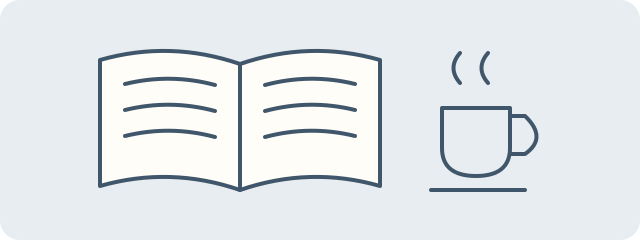

import Image from '@layouts/components/Image.astro';
import readingWindow from './assets/reading-window.svg';

A picture can give a story room to breathe. Select an image to take a closer look, then move between pictures with the arrow buttons, keyboard arrows, or a swipe. Press Escape or select Close to return to the page.

## A wide view

<figure>
  <Image
    src="/assets/images/banner.png"
    alt="Nayuta theme banner"
    loading="eager"
  />
  <figcaption>A little space between one chapter and the next.</figcaption>
</figure>

## A quiet corner

<figure>
  <Image
    src={readingWindow}
    alt="An arched window above a stack of books and a cup of tea"
    width={360}
  />
  <figcaption>
    The reading room, after everyone else has gone to sleep.
  </figcaption>
</figure>

## Notes on the desk

## Another framing

This wide crop shows a detail of the same room. Open it to see the complete illustration.

<figure>
  <Image
    src={readingWindow}
    alt="A detail from the reading room"
    ratio="16 / 9"
  />
  <figcaption>A different frame for the same story.</figcaption>
</figure>

## A familiar face

Small portraits can stay part of the page without opening the viewer.

<Image
  src="/assets/images/characters/itsuki.png"
  alt="Itsuki Hashima"
  lightbox={false}
/>

## Invalid image

[Browse every example](/demo).
